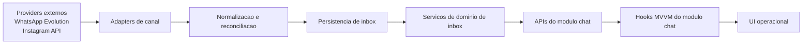
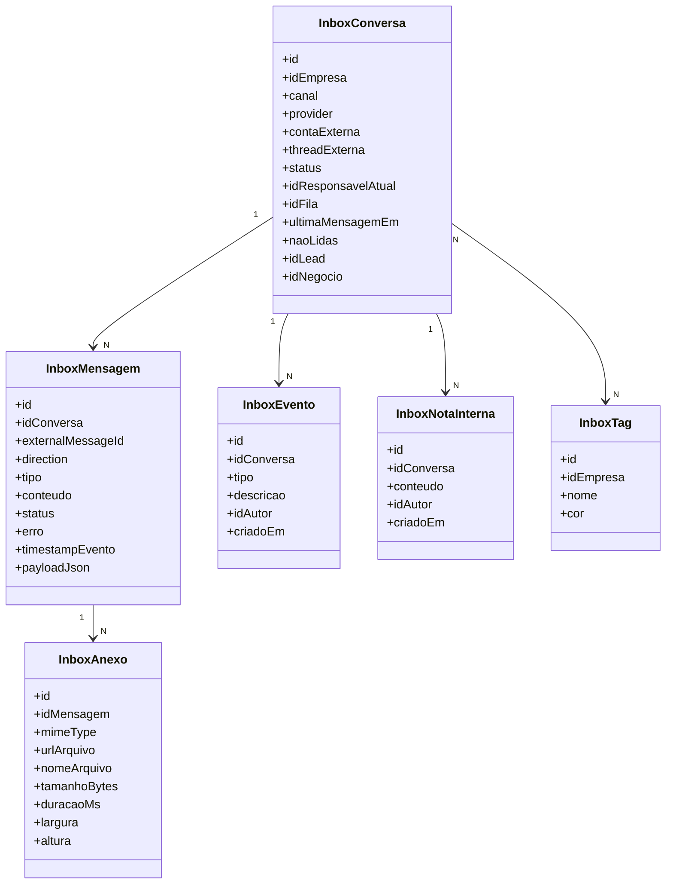
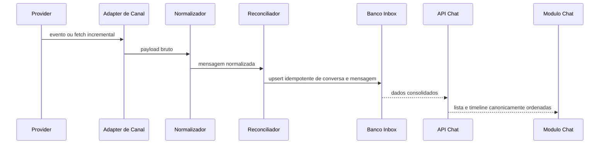
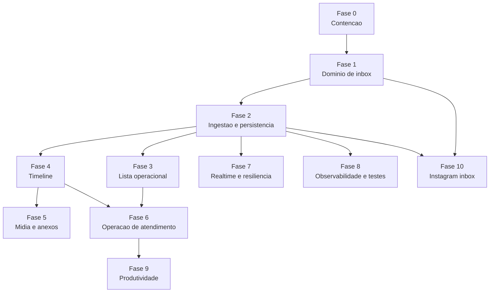

# Plano do modulo Chat Inbox

## Briefing executivo

Transformar o modulo `/chat` do HYPE CRM de uma implementacao parcial de visualizacao e envio de mensagens em uma **inbox operacional forte**, preparada para:

- operacao comercial diaria
- atendimento com ownership e fila
- mensagens e anexos confiaveis
- reconciliacao robusta com provider
- observabilidade em producao
- evolucao real para omnichannel, com WhatsApp forte agora e Instagram inbox depois

Este plano parte de uma conclusao objetiva da auditoria:

- o `/chat` atual ja entrega listagem, conversa ativa e envio de texto
- a base atual ainda e fraca para escala, confiabilidade e UX operacional
- ja existe um stack de WhatsApp mais maduro no projeto que deve virar fundacao do novo nucleo
- insistir em evoluir o `/chat` atual sem reestruturar o nucleo vai gerar remendo, retrabalho e travamento futuro

## Objetivo do produto

Ao final deste roadmap, o modulo `/chat` deve responder bem a estas perguntas:

- qual conversa exige acao agora?
- quem esta responsavel por cada atendimento?
- quantas conversas estao sem resposta ou sem dono?
- a mensagem foi enviada, entregue, lida ou falhou?
- o operador consegue responder rapido com contexto de lead e negocio?
- a base aceita novos canais sem colapsar a modelagem?

## Principios canonicos

### 1. O chat deve ser entidade de produto, nao tela derivada do provider

- `Conversation` e `Message` devem existir no dominio interno
- a UI nao deve depender de payload cru da Evolution como fonte principal

### 2. O `/chat` deve reaproveitar a base WhatsApp mais madura que ja existe

Arquivos candidatos a fundacao:

- `src/lib/whatsapp-chat.persistence.ts`
- `src/lib/whatsapp-chat.evolution.ts`
- `src/lib/whatsapp-chat.normalization.ts`
- `src/lib/whatsapp-chat.resolvers.ts`
- `src/modules/whatsapp/hooks/use-whatsapp-chat.ts`

### 3. Omnichannel exige identidade correta de conversa

Nunca usar apenas telefone como identidade principal.

A identidade minima de conversa precisa considerar:

- `canal`
- `provider`
- `conta ou instancia`
- `externalThreadId`

### 4. Operacao vem antes de encantamento visual

Antes de emoji, reply bonito e outras camadas de refinamento, o modulo precisa ter:

- unread real
- ownership
- status confiavel
- retry
- anexos reais
- filtros bons
- performance
- observabilidade

## Estado atual resumido

### O que existe hoje

- lista de conversas
- abertura de conversa
- leitura inicial de mensagens
- envio de texto
- SSE com polling
- conversao de conversa orfa em lead ou negocio

### Principais lacunas atuais

- paginacao quebrada
- preview da ultima mensagem inconsistente
- sem unread confiavel
- sem mark as read forte
- sem ownership
- sem transferencia
- sem anexos reais
- sem timeline operacional
- sem modelo omnichannel adequado
- sem observabilidade suficiente

## Definicao de pronto do modulo forte

O `/chat` so pode ser considerado forte quando todas as condicoes abaixo forem verdadeiras:

- a lista de conversas escala com volume real
- unread e leitura sao confiaveis
- mensagens nao somem, nao duplicam e nao trocam de ordem de forma errada
- envio possui estados reais: pendente, enviada, entregue, lida e falha
- anexos funcionam ponta a ponta
- ownership e transferencia estao operacionais
- filtros server-side resolvem fila diaria
- lead e negocio aparecem como contexto natural da conversa
- logs, metricas e falhas podem ser auditados
- o mesmo dominio suporta WhatsApp hoje e Instagram depois sem gambiarra

## Arquitetura alvo

### Visao em camadas



### Principais componentes



### Fluxo ideal de sincronizacao



## Estrutura alvo sugerida

```text
src/
  app/
    (dashboard)/chat/page.tsx
    api/chat/
      conversas/route.ts
      conversas/[id]/route.ts
      conversas/[id]/mensagens/route.ts
      conversas/[id]/marcar-lida/route.ts
      conversas/[id]/assumir/route.ts
      conversas/[id]/transferir/route.ts
      conversas/[id]/notas/route.ts
      conversas/[id]/tags/route.ts
      conversas/stream/route.ts
  modules/chat/
    page.tsx
    types.ts
    hooks/
      use-chat-module.ts
      use-chat-conversations.ts
      use-chat-timeline.ts
      use-chat-compose.ts
    components/
      chat-sidebar.tsx
      chat-toolbar.tsx
      chat-item.tsx
      chat-panel.tsx
      chat-timeline.tsx
      chat-composer.tsx
      chat-details-sheet.tsx
      chat-notes-panel.tsx
      chat-transfer-dialog.tsx
  lib/chat/
    chat.types.ts
    chat.providers.ts
    chat.service.ts
    chat.reconciliation.ts
    chat.search.ts
    chat.permissions.ts
    providers/
      whatsapp/
      instagram/
```

## Fases oficiais do roadmap

### Fase 0. Contencao imediata

#### Objetivo

Parar de ampliar a base errada.

#### Entregas

- congelar novas features grandes em cima do `/chat` atual
- definir o stack maduro de WhatsApp como base oficial da nova arquitetura
- mapear reaproveitamento e descarte dos arquivos atuais do `/chat`
- documentar contrato alvo de conversa, mensagem e sincronizacao

#### Tarefas

- revisar `src/lib/chat-unificado.ts`
- revisar `src/lib/evolution-api.chat.ts`
- revisar `src/lib/whatsapp-chat.*`
- decidir o que sera migrado e o que sera aposentado
- criar este plano como documento canonico de execucao

#### Definicao de pronto

- uma arquitetura alvo foi aceita
- novas features nao entram mais no fluxo antigo sem justificativa

### Fase 1. Fundacao do dominio de inbox

#### Objetivo

Criar o nucleo correto de dados e regras de dominio.

#### Entregas

- criar modelos de inbox no Prisma
- criar enums de canal, status de conversa e status de mensagem
- criar vinculo de conversa com lead e negocio
- criar ownership atual e historico de ownership
- criar entidade de evento interno e nota interna

#### Tarefas

- evoluir `prisma/schema.prisma`
- criar migracao Prisma inicial
- criar tipos em `src/lib/chat/chat.types.ts`
- definir identidade canonica de conversa
- remover dependencia conceitual de dedupe por telefone

#### Risco mitigado

- travamento futuro para omnichannel
- perda de contexto entre instancias e canais

#### Definicao de pronto

- existe modelo de conversa interno
- existe modelo de mensagem interno
- o dominio nao depende de uma unica estrutura WhatsApp-only

### Fase 2. Ingestao, normalizacao e persistencia confiavel

#### Objetivo

Fazer a fonte real do chat ser o dominio interno persistido.

#### Entregas

- adapter oficial de WhatsApp
- pipeline de normalizacao
- reconciliacao idempotente
- persistencia de conversa, mensagem e status
- mecanismo de mark as read real
- jobs de sincronizacao incremental e backfill

#### Tarefas

- reaproveitar e adaptar `src/lib/whatsapp-chat.persistence.ts`
- reaproveitar e adaptar `src/lib/whatsapp-chat.evolution.ts`
- reaproveitar e adaptar `src/lib/whatsapp-chat.normalization.ts`
- reaproveitar e adaptar `src/lib/whatsapp-chat.resolvers.ts`
- criar `src/lib/chat/chat.reconciliation.ts`
- criar `src/lib/chat/providers/whatsapp/*`

#### Definicao de pronto

- novas consultas do chat leem do banco interno
- provider vira adapter, nao fonte de verdade da UI

### Fase 3. Nova lista de conversas operacional

#### Objetivo

Transformar a sidebar em fila real de trabalho.

#### Entregas

- API de conversas com paginação server-side
- ✅ busca server-side (implementada: Evolution API com filtro where)
- filtros server-side
- ordenacao por ultima atividade
- unread real
- preview real da ultima mensagem
- badges de canal, ownership e status

#### Tarefas

- substituir `/api/chat/all` por rota canonica de conversas
- corrigir merge de paginação em `use-chat-data.ts` ou substitui-lo por hook novo
- exibir nao lidas, responsavel e canal em `chat-item.tsx`
- criar filtros: minhas, sem responsavel, nao lidas, canal, status, orfas, com lead

#### Definicao de pronto

- lista nao reseta ao paginar
- lista nao depende de busca local limitada ao que ja esta carregado

### Fase 4. Nova timeline de mensagens

#### Objetivo

Dar confiabilidade e fluidez para a conversa ativa.

#### Entregas

- paginação real ou infinite scroll
- merge incremental sem sobrescrever historico
- optimistic message local
- retry de envio
- estados visuais por mensagem
- mensagens agendadas com fila visivel no composer e timeline
- separacao entre mensagem, evento e nota interna

#### Tarefas

- substituir `use-chat-messages.ts` por hook de timeline sobre o dominio novo
- refatorar `chat-messages-panel.tsx`
- exibir estados: pendente, enviada, entregue, lida, falhou
- implementar reenvio seguro
- implementar mark as read ao abrir ou focar conversa

#### Definicao de pronto

- timeline suporta alto volume sem reset visual
- falhas de envio nao ficam invisiveis para o operador

### Fase 5. Midia e anexos reais

#### Objetivo

Sair do placeholder e virar inbox funcional.

#### Entregas

- upload real de imagem, video, audio e documento
- preview e download
- tratamento de falha de upload
- anexos persistidos com metadados

#### Tarefas

- criar `InboxAnexo`
- criar endpoints de upload e envio de midia
- ligar providers e storage
- exibir renderer real de imagem, audio, video e documento

#### Definicao de pronto

- operador consegue enviar e consultar midia ponta a ponta

### Fase 6. Operacao de atendimento

#### Objetivo

Fazer o modulo funcionar para equipe e processo comercial.

#### Entregas

- assumir conversa
- transferir conversa
- fila ou equipe
- tags
- notas internas
- status de atendimento
- eventos operacionais na timeline
- acoes de lead e negocio contextualizadas

#### Tarefas

- criar rotas de ownership
- criar historico de transferencia
- criar painel lateral de contexto operacional
- melhorar `chat-panel.tsx`
- esconder ou adaptar acoes que hoje aparecem fora de contexto

#### Definicao de pronto

- a conversa deixa de ser apenas canal de mensagem e vira unidade operacional

### Fase 7. Realtime e resiliencia

#### Objetivo

Melhorar a experiencia de tempo real sem perder confiabilidade.

#### Entregas

- reduzir polling bruto como fonte principal
- usar webhook ou evento de provider quando possivel
- usar SSE ou WebSocket como distribuicao interna para UI
- replay e reconciliacao apos desconexao
- backoff e retomada automatica
- indicadores reais de conexao

#### Tarefas

- revisar `src/lib/whatsapp-chat-realtime.sse.ts`
- revisar `src/lib/whatsapp-chat-realtime.state.ts`
- desacoplar stream do snapshot bruto por polling fixo
- garantir ordenacao e dedupe no merge da timeline

#### Definicao de pronto

- a UI nao depende apenas de repolling completo para parecer atualizada

### Fase 8. Observabilidade, seguranca e testes

#### Objetivo

Tornar o modulo operavel em producao sem voar cego.

#### Entregas

- logging estruturado por conversa e mensagem
- metricas de sync, envio, erro e backlog
- autorizacao forte por empresa, instancia, conversa e ownership quando aplicavel
- cobertura de testes unitarios e integracao
- remocao de payloads de debug do frontend

#### Tarefas

- endurecer rotas em `src/app/api/chat/*`
- cobrir cenarios de erro e permissao
- adicionar testes para reconciliacao, unread, ownership, transferencia e midia
- remover exposicao de debug em `/api/chat/all`

#### Definicao de pronto

- ha rastreabilidade minima para investigar erro de producao

### Fase 9. Produtividade do operador

#### Objetivo

Reduzir tempo de resposta e friccao operacional.

#### Entregas

- respostas rapidas
- atalhos de teclado
- filtros salvos
- SLA e tempo sem resposta
- busca mais ampla por nome, telefone, lead e negocio

#### Tarefas

- criar modulo de atalhos
- criar templates por contexto
- criar indicadores operacionais por conversa

#### Definicao de pronto

- operadores conseguem atender com velocidade e contexto

### Fase 10. Instagram inbox real

#### Objetivo

Plugar o segundo canal sem remendar a arquitetura.

#### Entregas

- adapter Instagram
- ingestao de conversas e mensagens
- normalizacao no mesmo dominio
- diferencas de capability tratadas na UI

#### Tarefas

- criar `src/lib/chat/providers/instagram/*`
- criar estrategia de sincronizacao por conta conectada
- exibir badge e comportamento por canal

#### Definicao de pronto

- WhatsApp e Instagram convivem no mesmo dominio de inbox sem forks conceituais

## Dependencias entre fases



## Ordem otimizada de execucao

### Sequencia recomendada

1. Fase 0
2. Fase 1
3. Fase 2
4. Fase 3
5. Fase 4
6. Fase 6
7. Fase 8
8. Fase 5
9. Fase 7
10. Fase 9
11. Fase 10

### Motivo desta ordem

- sem dominio e persistencia corretos, a UI vira remendo
- sem lista e timeline fortes, o modulo nao sustenta operacao
- sem ownership, o chat nao serve equipe de verdade
- sem observabilidade, qualquer problema de sync vira caixa-preta
- Instagram deve entrar depois que o dominio ja estiver pronto

## Backlog executivo por prioridade

### Critico

- criar dominio de inbox
- remover dedupe por telefone como regra central
- reaproveitar stack WhatsApp mais maduro
- persistir conversa e mensagem como fonte canonica
- unread e mark as read reais
- ownership e transferencia
- corrigir paginação e merge
- suporte real a status de mensagem
- endurecer autorizacao
- observabilidade e testes basicos

### Importante

- tags
- notas internas
- filtros server-side avancados
- anexos reais
- timeline com eventos
- produtividade com atalhos e respostas rapidas

### Melhoria

- virtualizacao
- analytics de atendimento
- SLA refinado
- filtros salvos
- refinamentos de acessibilidade e microinteracoes

## Sugestoes diretas por arquivo atual

### Revisar ou aposentar

- `src/lib/chat-unificado.ts`
- `src/lib/evolution-api.chat.ts`
- `src/app/api/chat/all/route.ts`
- `src/app/api/chat/messages/route.ts`
- `src/app/api/chat/messages/stream/route.ts`
- `src/modules/chat/hooks/use-chat-data.ts`
- `src/modules/chat/hooks/use-chat-messages.ts`

### Reaproveitar como fundacao

- `src/lib/whatsapp-chat.persistence.ts`
- `src/lib/whatsapp-chat.evolution.ts`
- `src/lib/whatsapp-chat.normalization.ts`
- `src/lib/whatsapp-chat.resolvers.ts`
- `src/modules/whatsapp/hooks/use-whatsapp-chat.ts`

### Refatorar UI

- `src/modules/chat/components/chat-item.tsx`
- `src/modules/chat/components/chat-panel.tsx`
- `src/modules/chat/components/chat-messages-panel.tsx`
- `src/modules/chat/components/chat-details-panel.tsx`

## Checklist de validacao por etapa

### Checklist tecnico minimo

- toda rota nova de chat começa com `exigirSessao(request)`
- todo payload novo usa Zod de forma canonica
- toda mutacao com multiplas tabelas usa transacao Prisma
- o frontend do modulo segue o padrao MVVM do projeto
- o canal e modelado como abstracao de dominio, nao if espalhado na UI

### Checklist operacional minimo

- existe fila de trabalho clara na sidebar
- existe ownership visivel
- existe acao rapida para lead e negocio
- operador entende quando uma mensagem falhou
- operador entende quando uma conversa esta sem resposta
- operador enxerga contexto suficiente para agir sem trocar de tela o tempo todo

## Conclusao direta

O caminho otimizado nao e adicionar feature por cima do `/chat` atual.

O caminho otimizado e:

1. consolidar o dominio de inbox
2. mover o `/chat` para cima de uma persistencia confiavel
3. resolver operacao real de atendimento
4. so depois expandir para omnichannel completo

Se a equipe seguir esta ordem, o modulo deixa de ser parcial e passa a ser uma base forte de atendimento dentro do HYPE CRM.
